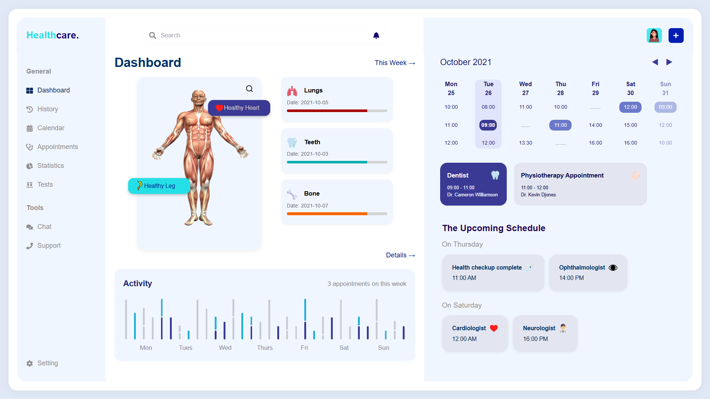

# 🏥 Healthcare Dashboard (React - Static Display)

A pixel-perfect, fully responsive **Healthcare Dashboard** built using React. This project is a static, non-interactive representation of a professional healthcare management interface, meticulously recreated based on a design reference image.

## 🔍 Overview

This project demonstrates frontend skills in **component-based architecture**, **CSS styling**, and **responsiveness**, showcasing the ability to:

* Break down complex UIs into **reusable React components**.
* Use **static mock data** passed via props.
* Apply styling with **pixel-perfect accuracy**.
* Ensure **cross-device responsiveness**.
* Maintain **clean code** and a **logical file structure**.

## 📸 Screenshot



## 🧱 Features Implemented

### 📁 Layout Structure

* **Header:** Logo, search bar, notification icon, user avatar, and add button.
* **Sidebar Navigation:** Static links (Dashboard, Calendar, Appointments, etc.).
* **Main Dashboard Content:**

  * **DashboardOverview**
  * **AnatomySection** – Human body illustration with health indicators.
  * **HealthStatusCards** – Lungs, Teeth, Bone health status.
  * **CalendarView** – Static monthly view with appointment slots.
  * **UpcomingSchedule** – Static appointment cards grouped by days.
  * **ActivityFeed** – Text and chart showing weekly activity.

### 🧩 Component Architecture

All visual sections are modular and reusable React components:

```
src/
├── components/
│   ├── AnatomySection.jsx
│   ├── HealthStatusCards.jsx
│   ├── CalendarView.jsx
│   ├── UpcomingSchedule.jsx
│   ├── ActivityFeed.jsx
├── data/
│   ├── ActivityData.jsx
│   ├── AppointmentData.jsx
│   ├── CalenderData.jsx
│   └── HealthMetricsData.jsx
├── sections/
│   ├── App.jsx
│   ├── DashboardMainContent.jsx
│   ├── Header.jsx
│   └── Sidebar.jsx
```

### 📊 Static Data Rendering

Mock data is organized in `src/data/` and passed via props. No interactivity or state management is used.

### 🎨 Styling

* **Pixel-perfect fidelity** with exact spacing, color palette, border radii, shadows, and typography.
* **Responsiveness** ensured via **CSS Grid**, **Flexbox**, and **Media Queries**.

### 💡 Technologies Used

* **React** (Vite or Create React App)
* **Tailwind CSS**
* **Lucide React** for icons
* **Open-source SVGs / Images** for anatomical figures

## 🚀 Live Demo

🔗 [Live Website (Deployed on Vercel)](https://fitpeo-health-care.vercel.app)
🔗 [Public GitHub Repository](https://github.com/harshpimpale/Fitpeo-HealthCare)

> Replace the above URLs with your actual deployment and repo links.

## 🛠️ Installation & Setup

```bash
# 1. Clone the repo
git clone https://github.com/harshpimpale/Fitpeo-HealthCare.git
cd Fitpeo-HealthCare

# 2. Install dependencies
npm install

# 3. Run the development server
npm run dev   # or npm start if using CRA
```

## 📁 Folder Structure (Summary)

```
src/
├── assets/                 # Images and static assets
├── components/             # Reusable React components
├── data/                   # Static mock data for UI
├── App.js                  # Root component
├── index.js                # App entry point
└── ...
```

## ✅ Completed As Per Assignment Requirements

* ✅ Responsive, pixel-perfect UI
* ✅ No interactivity (static display only)
* ✅ Static mock data passed via props
* ✅ Organized and reusable components
* ✅ Header, Sidebar, Calendar, Anatomy View, Schedule, and Activity Chart
* ✅ Deployed on a live server (Vercel/Netlify)

## ⚠️ Note

This project is **strictly static** – no use of React state, hooks, or API calls. All visual data is hardcoded via props and mock data files.

## 📩 Contact

If you have questions about the project or want to connect:

**Name:** \[Harsh Pimpale]
**Email:** \[harshpimpale@gmail.com](mailto:harshpimpale@gmail.com)
**Portfolio:** \[harshpimpale.vercel.app]

---

> 🌟 *This project was created as part of a frontend developer assignment to demonstrate strong visual fidelity, component structure, and responsive design in React.*

---

